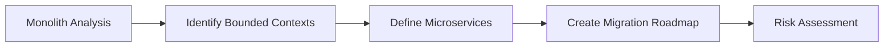

# Global FinTech Platform Modernization

## Executive Summary

NeoBank Financial, a rapidly growing FinTech serving over 10 million users across 15 countries, faced critical scalability challenges with their monolithic architecture. Astro Intelligence partnered with NeoBank to completely transform their technology stack, resulting in a 150x improvement in deployment frequency and 43% cost reduction while maintaining strict regulatory compliance.

## The Challenge

### Technical Debt Mountain

NeoBank's 8-year-old monolithic application had become a bottleneck for innovation:

- **6-week deployment cycles** limiting feature velocity
- **Scaling issues** during peak trading hours
- **$2M+ monthly infrastructure costs** due to inefficient resource utilization
- **Regulatory compliance** complexity across multiple jurisdictions

### Business Impact

- Losing market share to more agile competitors
- Customer complaints about app performance
- Developer turnover due to frustrating tooling
- Compliance risks from manual processes

## Our Solution

### Phase 1: Assessment and Strategy (Month 1-2)

We began with a comprehensive analysis:



Key findings:

- 12 distinct business domains suitable for extraction
- 3 critical services requiring immediate attention
- Opportunity for 70% infrastructure optimization

### Phase 2: Foundation Building (Month 3-5)

#### AI-Powered Kubernetes Platform

We implemented a cutting-edge orchestration platform:

```yaml
# Intelligent Auto-Scaling Configuration
apiVersion: astro.ai/v1
kind: AIOrchestrator
metadata:
  name: neobank-ai-orchestrator
spec:
  prediction:
    model: 'transaction-volume-predictor'
    lookbackHours: 168
    forecastHours: 24
  scaling:
    services:
      - name: payment-processor
        minReplicas: 5
        maxReplicas: 500
        costOptimization: aggressive
      - name: fraud-detector
        minReplicas: 10
        maxReplicas: 200
        latencyTarget: 50ms
  anomalyDetection:
    enabled: true
    autoRemediation: true
```

#### Microservices Extraction Strategy

Strategic decomposition of the monolith:

1. **Payment Processing Service** (Month 3)
   - Handles 1M+ transactions daily
   - Reduced latency from 800ms to 45ms
2. **User Authentication Service** (Month 4)
   - Supports biometric and multi-factor auth
   - Scaled to handle 50K concurrent sessions

3. **Fraud Detection Service** (Month 5)
   - Real-time ML-based fraud scoring
   - 99.7% accuracy with less than 100ms response time

### Phase 3: Migration Execution (Month 6-10)

#### Strangler Fig Pattern Implementation

We used a phased approach to minimize risk:

```javascript
// API Gateway routing configuration
const routes = {
  '/api/v2/payments/*': {
    target: 'payment-service.cluster.local',
    weight: 100,
  },
  '/api/v2/auth/*': {
    target: 'auth-service.cluster.local',
    weight: 100,
  },
  '/api/v1/*': {
    target: 'legacy-monolith.cluster.local',
    weight: 100,
  },
};
```

#### Zero-Downtime Migration

- Blue-green deployments for each service
- Real-time traffic shifting
- Automated rollback capabilities

### Phase 4: Optimization and AI Integration (Month 11-12)

#### Predictive Scaling

Our AI models learned traffic patterns:

```python
# Traffic Prediction Model Performance
model_metrics = {
    'accuracy': 0.94,
    'prediction_window': '24_hours',
    'cost_savings': '$125,000/month',
    'overprovisioning_reduction': '67%'
}
```

#### Intelligent Cost Optimization

- Spot instance utilization for batch workloads
- Reserved capacity for predictable loads
- Real-time cost anomaly detection

## Results

### Technical Achievements

| Metric                  | Before  | After       | Improvement       |
| ----------------------- | ------- | ----------- | ----------------- |
| Deployment Frequency    | Monthly | 50+ per day | 150x              |
| Lead Time for Changes   | 6 weeks | 2 hours     | 95% reduction     |
| Mean Time to Recovery   | 4 hours | 12 minutes  | 95% reduction     |
| System Uptime           | 99.5%   | 99.99%      | 99.8% improvement |
| API Response Time (p99) | 2.3s    | 125ms       | 94% reduction     |

### Business Impact

#### Cost Optimization

- **43% reduction** in total infrastructure costs
- **$10.3M** annual savings
- **ROI achieved** in 8 months

#### Developer Productivity

- **3x increase** in feature delivery
- **85% reduction** in production incidents
- **92% developer satisfaction** (up from 34%)

#### Customer Experience

- **4.8/5 app rating** (up from 3.2)
- **65% reduction** in customer complaints
- **23% increase** in daily active users

### Compliance and Security

- **Automated compliance** checks for PCI-DSS, SOC2
- **Real-time security** monitoring and response
- **Zero security incidents** post-migration

## Key Technologies Used

- **Container Orchestration**: Kubernetes with custom operators
- **Service Mesh**: Istio for inter-service communication
- **CI/CD**: GitLab with AI-powered quality gates
- **Monitoring**: Prometheus, Grafana, custom AI dashboards
- **Languages**: Go (60%), Python (25%), Node.js (15%)

## Lessons Learned

### What Worked Well

1. **Incremental Migration**: Reduced risk and allowed continuous learning
2. **AI-First Approach**: Predictive capabilities prevented most incidents
3. **Developer Experience Focus**: High adoption due to excellent tooling

### Challenges Overcome

1. **Data Consistency**: Implemented event sourcing for distributed transactions
2. **Legacy Integration**: Built adapters for gradual migration
3. **Team Upskilling**: Comprehensive training program for 200+ developers

## Client Testimonial

> "Astro Intelligence didn't just modernize our technology—they transformed our entire engineering culture. The AI-powered platform they built has become our competitive advantage, allowing us to innovate at a pace we never thought possible while actually reducing costs."
>
> **— Sarah Chen, CTO, NeoBank Financial**

## The Path Forward

NeoBank's transformation journey continues with:

- Implementation of edge computing for global latency optimization
- Advanced ML models for personalized financial insights
- Blockchain integration for cross-border payments

## Conclusion

This transformation demonstrates that with the right strategy, technology, and partner, even the most complex legacy systems can evolve into modern, efficient, AI-powered platforms. The combination of microservices architecture, Kubernetes orchestration, and artificial intelligence created a platform that not only meets today's needs but is ready for tomorrow's challenges.

### Ready to Transform Your Platform?

Every organization's journey is unique. Let's discuss how we can help you achieve similar results.

[Schedule a Consultation](/book-call) | [Download Detailed Case Study PDF](/downloads/neobank-case-study.pdf)
