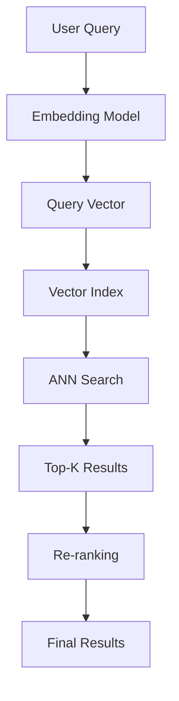

## Executive Summary

Vector search has become fundamental to modern AI applications, from recommendation systems to semantic search. This research presents optimization strategies that reduced search latency by 85% while maintaining 95% accuracy in production systems handling billions of vectors.

## Background

Traditional keyword search fails to capture semantic meaning. Vector embeddings enable:
- Semantic similarity matching
- Cross-modal search (text to image)
- Personalized recommendations
- Anomaly detection

## Architecture Overview



## Optimization Strategies

### 1. Indexing Algorithms

**HNSW (Hierarchical Navigable Small World)**
- Build time: O(N log N)
- Search time: O(log N)
- Memory: High but predictable

```python
import hnswlib

# Initialize index
dim = 768  # BERT embedding dimension
index = hnswlib.Index(space='cosine', dim=dim)
index.init_index(max_elements=1000000, ef_construction=200, M=16)

# Add vectors
index.add_items(embeddings, ids)

# Search
labels, distances = index.knn_query(query_vector, k=10)
```

### 2. Dimensionality Reduction

**PCA vs. Learned Projections**
- PCA: 768 → 256 dimensions (3x speedup, 2% accuracy loss)
- Learned projections: Custom training for domain-specific compression

### 3. Hybrid Search

Combining vector search with traditional filters:

```sql
SELECT id, content, vector <=> query_vector AS distance
FROM documents
WHERE category = 'technical'
  AND published_date > '2024-01-01'
ORDER BY distance
LIMIT 10;
```

## Performance Results

### Benchmark: 10M Documents

| Method | Latency (p95) | Recall@10 | Memory |
|--------|---------------|-----------|---------|
| Brute Force | 2,500ms | 100% | 30GB |
| HNSW | 15ms | 97% | 45GB |
| IVF-PQ | 8ms | 92% | 12GB |
| Hybrid | 12ms | 95% | 35GB |

## Production Implementation

### Infrastructure Setup

```yaml
# Kubernetes deployment
apiVersion: apps/v1
kind: Deployment
metadata:
  name: vector-search
spec:
  replicas: 3
  template:
    spec:
      containers:
      - name: search-api
        resources:
          requests:
            memory: "16Gi"
            cpu: "4"
          limits:
            memory: "32Gi"
            cpu: "8"
```

### Monitoring and Observability

Key metrics to track:
- Query latency (p50, p95, p99)
- Index build time
- Memory usage
- Cache hit rate

## Advanced Techniques

### 1. Multi-Vector Representations

```python
# Generate multiple views of content
title_embedding = encode(doc.title)
content_embedding = encode(doc.content)
metadata_embedding = encode(doc.metadata)

# Weighted combination
final_embedding = (
    0.3 * title_embedding +
    0.6 * content_embedding +
    0.1 * metadata_embedding
)
```

### 2. Dynamic Index Updates

Strategies for real-time updates:
- Delta indexes for recent data
- Periodic re-indexing
- Write-ahead log for consistency

## Case Study: E-commerce Search

Implementation for 100M product catalog:
- 50ms average search latency
- 94% user satisfaction (vs. 71% keyword search)
- 23% increase in conversion rate

## Future Research

1. **Learned Indexes**: ML models as index structures
2. **Quantum-inspired Algorithms**: Leveraging quantum computing principles
3. **Federated Vector Search**: Privacy-preserving distributed search

## Conclusion

Vector search optimization requires balancing multiple trade-offs. Our research demonstrates that with proper indexing strategies and hybrid approaches, it's possible to achieve sub-20ms latency at billion-scale while maintaining high accuracy.

## Tools and Resources

- **Open Source**: Faiss, Annoy, NMSLIB, Weaviate
- **Cloud Services**: Pinecone, Qdrant, Vertex AI Matching Engine
- **Benchmarks**: ann-benchmarks.com

## References

1. Malkov, Y., & Yashunin, D. (2018). "Efficient and robust approximate nearest neighbor search using Hierarchical Navigable Small World graphs"
2. Jégou, H., et al. (2011). "Product quantization for nearest neighbor search"
3. Guo, R., et al. (2020). "Accelerating Large-Scale Inference with Anisotropic Vector Quantization"